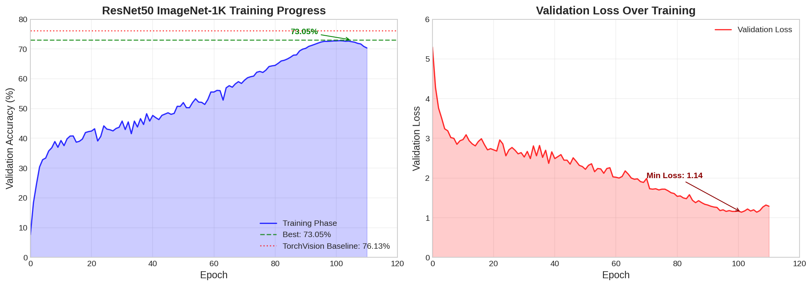
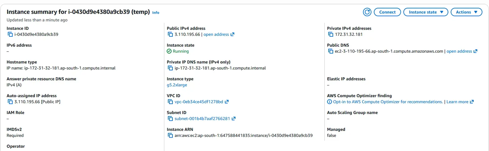
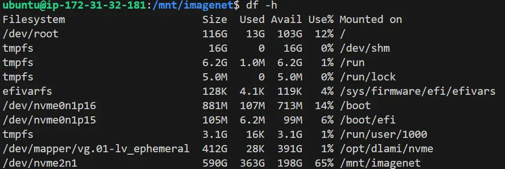

# 🚀 ResNet50 ImageNet-1K Training from Scratch

[](https://python.org)
[](https://pytorch.org)
[](https://aws.amazon.com)
[](#results)
[](https://huggingface.co/spaces/Rahul2020/Imagenet-Resnet50-App)

> **ERA V4 Course - Mini Capstone Project**
>
> Training a custom ResNet50 model from scratch on the full ImageNet-1K dataset using AWS EC2 spot instances, achieving **73.05% Top-1 validation accuracy**.

**Author:** Rahul Uniyal

---

## 🎮 Live Demo

Try the model live on Hugging Face Spaces!

[](https://huggingface.co/spaces/Rahul2020/Imagenet-Resnet50-App)
[](https://www.youtube.com/watch?v=hxzgjvSp2Nw)

**🔗 [Imagenet Resnet50 App - Live Demo](https://huggingface.co/spaces/Rahul2020/Imagenet-Resnet50-App)**

Upload any image and see the model classify it into one of 1000 ImageNet categories!

### 📺 Watch the Demo

[](https://www.youtube.com/watch?v=hxzgjvSp2Nw)

▶️ **[Watch on YouTube](https://www.youtube.com/watch?v=hxzgjvSp2Nw)** - See the model classify images in real-time!

---

## 📊 Results Summary

| Metric | Value |
|--------|-------|
| **Best Top-1 Accuracy** | **73.05%** |
| Best Validation Loss | 1.14 |
| Total Epochs | 118 |
| Training Time | ~4 days (cumulative GPU time) |
| Total Cost | ~$35 USD (spot instances) |

### Comparison with Baselines

| Model | Top-1 Accuracy | Top-5 Accuracy |
|-------|----------------|----------------|
| **This Implementation** | **73.05%** | - |
| TorchVision ResNet50 v1 | 76.13% | 92.86% |
| TorchVision ResNet50 v2 | 80.86% | 95.43% |
| Original Paper (He et al.) | 75.3% | 92.2% |

---

## 📈 Training Curves

### Validation Accuracy & Loss Progression



### Accuracy Journey: From 7.61% to 73.05%


---

## 🏗️ Model Architecture

Custom ResNet50 implementation with modern training enhancements:

```
ResNet50Custom
├── Conv1: 7×7, 64 filters, stride 2
├── MaxPool: 3×3, stride 2
├── Layer1: 3 Bottleneck blocks (64 → 256)
├── Layer2: 4 Bottleneck blocks (128 → 512)  
├── Layer3: 6 Bottleneck blocks (256 → 1024)
├── Layer4: 3 Bottleneck blocks (512 → 2048)
├── AdaptiveAvgPool: 1×1
└── FC: 2048 → 1000 classes
```

**Key Features:**
- ✅ Stochastic Depth (Drop Path) regularization
- ✅ Label Smoothing (0.1)
- ✅ MixUp & CutMix augmentation
- ✅ Exponential Moving Average (EMA)
- ✅ Mixed Precision Training (AMP)
- ✅ Cosine Annealing LR Schedule

---

## ⚙️ Training Configuration

### Hyperparameters

| Parameter | Value |
|-----------|-------|
| Batch Size | 128 |
| Initial Learning Rate | 0.1 |
| Optimizer | SGD (momentum=0.9, weight_decay=1e-4) |
| LR Schedule | Cosine Annealing |
| Epochs | 130 (target) |
| Image Size | 224×224 |
| EMA Decay | 0.9999 |

### Data Augmentation

**Training:**
- RandomResizedCrop (224, scale=0.08-1.0)
- RandomHorizontalFlip
- ColorJitter (brightness=0.4, contrast=0.4, saturation=0.4, hue=0.1)
- RandomErasing (p=0.25)
- MixUp (α=0.4-0.8)
- CutMix (α=1.0)

**Validation:**
- Resize to 256
- CenterCrop to 224
- Normalize (ImageNet mean/std)

---

## 🖥️ Infrastructure

### AWS EC2 Configuration

| Specification | Details |
|---------------|---------|
| Instance Type | **g5.2xlarge** (Spot Instance) |
| GPU | NVIDIA A10G (24GB VRAM) |
| vCPUs | 8 |
| Memory | 32 GB |
| Region | ap-south-1 |
| Storage | 590 GB NVMe SSD |

### AWS Instance Summary


### Storage Configuration


### Project Directory Structure


---

## 📁 Project Structure

```
/mnt/imagenet/
├── train/                     # 1.28M training images (1000 classes)
├── val/                       # 50K validation images
├── checkpoints/               # Model checkpoints
│   └── epoch_105_val73.05.pth # Best checkpoint
├── logs/
│   └── train.log              # Training logs
├── ILSVRC2012_img_train.tar   # ~138GB
├── ILSVRC2012_img_val.tar     # ~6.3GB
└── imagenet_class_index.json  # Class mappings
```

---

## 🏃 Training Progress

### Key Milestones

| Epoch | Val Accuracy | Val Loss | Notes |
|-------|-------------|----------|-------|
| 0 | 7.61% | 5.30 | Training started |
| 10 | 39.28% | 2.97 | Initial convergence |
| 50 | 52.01% | 2.22 | Crossed 50% |
| 74 | 62.19% | 1.70 | Rapid improvement |
| 90 | 70.23% | 1.32 | Crossed 70% |
| 101 | 72.80% | 1.14 | Near peak |
| **105** | **73.05%** | 2.00 | **Best accuracy (fine-tuned)** |

### Training Timeline

```
Nov 03, 2025 - Training started (Epoch 0)
Nov 05, 2025 - Crossed 50% accuracy (Epoch 50)  
Nov 06, 2025 - Crossed 70% accuracy (Epoch 90)
Nov 07, 2025 - Peak accuracy 73.05% (Epoch 105)
Nov 16, 2025 - Training concluded (Epoch 118)
```

---

## 🔥 Challenges & Solutions

### 1. Spot Instance Interruptions
**Challenge:** AWS spot instances were terminated multiple times during training, causing loss of progress.

**Solution:** Implemented a **resumable training script** that:
- Automatically finds the best checkpoint by validation accuracy
- Restores model, optimizer, scheduler, and scaler states
- Continues training from the last saved epoch
- Reduces LR by 10x when resuming for fine-tuning

```python
def find_best_checkpoint(ckpt_dir):
    ckpts = glob.glob(os.path.join(ckpt_dir, "epoch_*.pth"))
    best = max(ckpts, key=lambda p: parse_val_from_filename(p))
    return best
```

### 2. Cost Optimization
**Challenge:** Training on-demand instances would cost ~$200+

**Solution:** 
- Used spot instances (~80% cheaper)
- Implemented checkpoint saving every epoch
- Total cost: **~$35 USD**

### 3. EMA State Corruption
**Challenge:** EMA model showed 0.10% accuracy after some restarts due to state loading issues.

**Solution:** Added fallback to raw model evaluation and graceful handling of EMA state restoration failures.

---

## 🚀 Usage

### Prerequisites

```bash
pip install torch torchvision numpy datasets huggingface_hub Pillow
```

### Training

```bash
# Start training from scratch
python train_imagenet1k_resumable_v5.py

# Training automatically resumes from best checkpoint if interrupted
```

### Checkpoint Format

```python
{
    "epoch": 105,
    "model": model.state_dict(),
    "optimizer": optimizer.state_dict(),
    "scheduler": scheduler.state_dict(),
    "scaler": scaler.state_dict(),
    "ema": ema.module.state_dict(),
    "val_acc": 73.05
}
```

---

## 📊 Detailed Training Logs

<details>
<summary>Click to expand sample training logs</summary>

```
[2025-11-03 04:32:57] No checkpoint found — starting fresh training.
[2025-11-03 05:10:55] [Train] Epoch 0 Step 10000/10010 Loss 6.4866 Acc 1.89%
[2025-11-03 05:16:48] [Validation] Epoch 0 ValLoss 5.3013 ValAcc 7.61%
[2025-11-03 05:16:49] 💾 Saved checkpoint: epoch_0_val7.61.pth
...
[2025-11-06 21:27:41] [Validation] Epoch 101 ValLoss 1.1445 ValAcc 72.80%
[2025-11-06 21:27:42] 💾 Saved checkpoint: epoch_101_val72.80.pth
...
[2025-11-07 15:06:28] [Validation] Epoch 105 ValLoss 2.0003 ValAcc 73.05% (raw)
[2025-11-07 15:06:28] 💾 Saved checkpoint: epoch_105_val73.05.pth
```

</details>

---

## 🎯 Future Improvements

1. **Advanced Augmentations**
   - RandAugment / AutoAugment
   - Progressive resizing (start with 128, increase to 224)
   
2. **Architecture Enhancements**
   - Squeeze-and-Excitation (SE) blocks
   - Anti-aliasing (BlurPool)
   
3. **Training Techniques**
   - LAMB optimizer for larger batch sizes
   - Knowledge distillation from larger models
   - Test-time augmentation (TTA)
   
4. **Learning Rate**
   - Warmup epochs
   - One-cycle policy
   - Stochastic Weight Averaging (SWA)

5. **Target Accuracy**
   - Aim for 76%+ with above improvements
   - Multi-GPU training with DDP

---

## 📚 References

1. [Deep Residual Learning for Image Recognition](https://arxiv.org/abs/1512.03385) - He et al., 2015
2. [mixup: Beyond Empirical Risk Minimization](https://arxiv.org/abs/1710.09412) - Zhang et al., 2017
3. [CutMix: Regularization Strategy](https://arxiv.org/abs/1905.04899) - Yun et al., 2019
4. [TorchVision Models](https://pytorch.org/vision/stable/models.html)
5. [ImageNet Large Scale Visual Recognition Challenge](https://www.image-net.org/challenges/LSVRC/)

---

## 🔗 Links

- **Live Demo:** [🤗 HuggingFace Space](https://huggingface.co/spaces/Rahul2020/Imagenet-Resnet50-App)
- **Demo Video:** [📺 YouTube](https://www.youtube.com/watch?v=hxzgjvSp2Nw)
- **Source Code:** [💻 GitHub](https://github.com/rahulni/imageNet1k_RESNET50)
- **Author:** [👤 LinkedIn](https://www.linkedin.com/in/rahul-uniyal-3582231b/)
- **Course:** ERA V4

---

## 📜 License

This project is for educational purposes as part of the ERA V4 course.

---

<p align="center">
  <b>⭐ If you found this helpful, please star the repository! ⭐</b>
</p>

---

<p align="center">
  <a href="https://huggingface.co/spaces/Rahul2020/Imagenet-Resnet50-App">
    
  </a>
</p>
